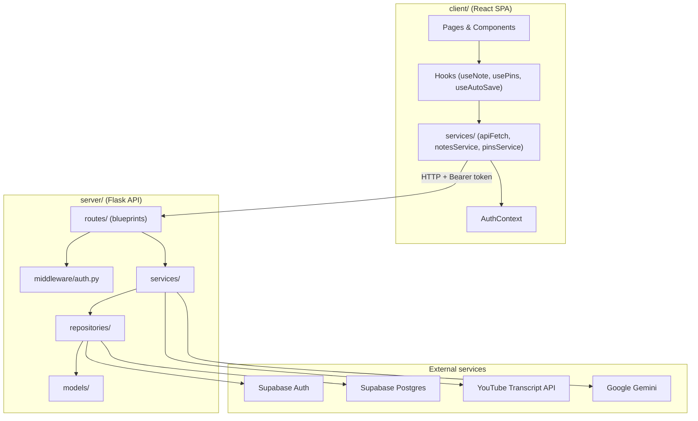
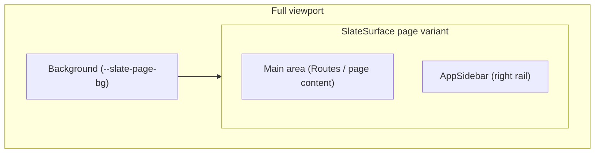
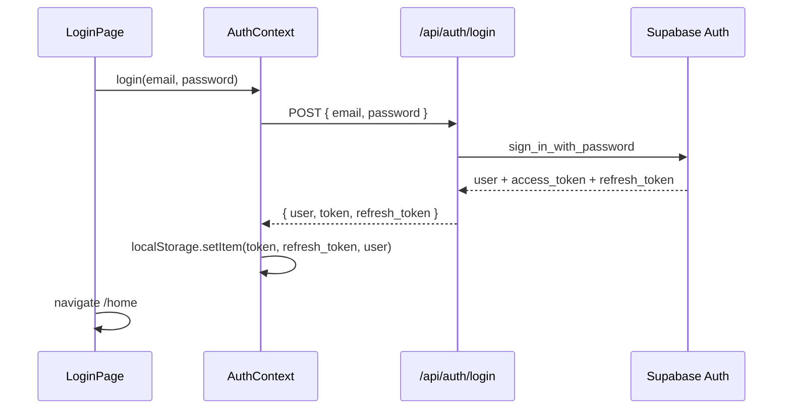
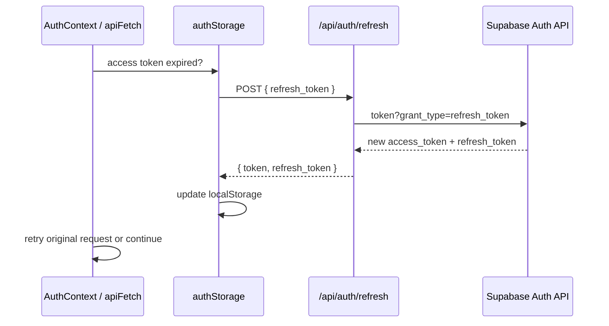
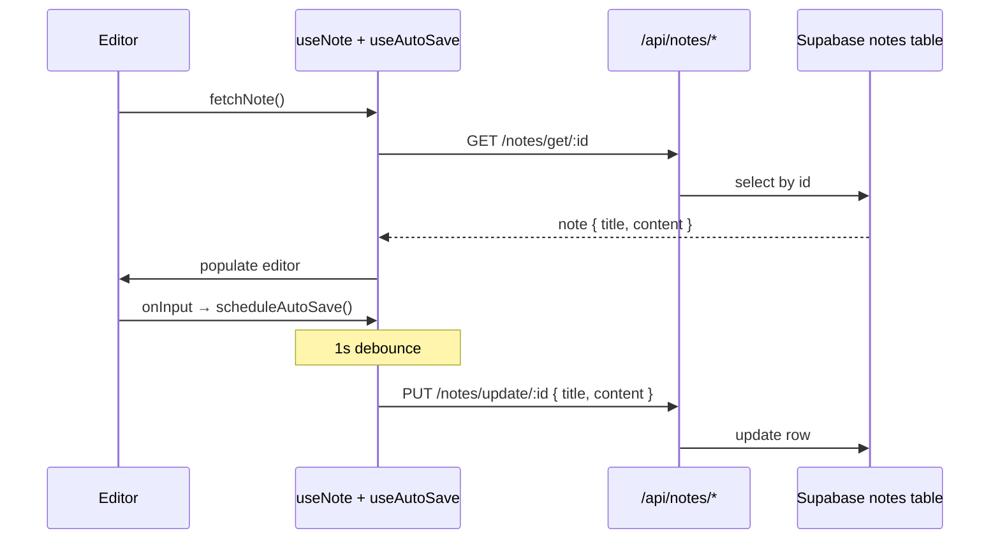
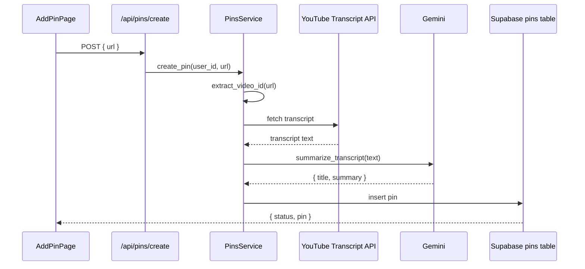

# Architecture

## Overview

pin-note is a client–server application. The React frontend talks to a Flask REST API, which owns all business logic and database access. External services (Supabase, Gemini, YouTube) are called only from the server layer.

## Backend layers

### Routes (`server/routes/`)

Thin HTTP handlers. Each blueprint parses the request, reads `g.user` (set by auth middleware), delegates to a service, and returns JSON.

| Blueprint | Prefix | Responsibility |
|-----------|--------|----------------|
| `auth_routes` | `/api/auth` | Register, login, refresh, logout |
| `notes_routes` | `/api/notes` | CRUD for notes |
| `pins_routes` | `/api/pins` | List and create pins |

Services and repositories are instantiated once at module load time in each route file.

### Middleware (`server/middleware/auth.py`)

Runs on every request via `app.before_request`. Skips `OPTIONS` preflight and public auth routes (`/api/auth/login`, `/api/auth/register`, `/api/auth/refresh`, `/api/auth/logout`). For all other paths under `/api/*`, validates the `Authorization: Bearer` token with Supabase and attaches the user to Flask's `g.user`.

### Services (`server/services/`)

Business logic and authorization rules. Services never execute SQL directly — they call repository interfaces.

| Service | Key behavior |
|---------|--------------|
| `AuthService` | Password length, email format, duplicate-email checks; refresh and logout via repository |
| `NotesService` | Ownership check on `get_note_by_id` (raises `ForbiddenError` if `user_id` mismatch) |
| `PinsService` | YouTube URL validation, transcript fetch, Gemini summarization, then persist via repository |

### Repositories (`server/repositories/`)

Abstract interfaces (`IUserRepository`, `INotesRepository`, `IPinsRepository`) with Supabase implementations. All database and auth-provider calls live here.

### Models (`server/models/`)

Plain Python classes (`User`, `Note`, `Pin`) with a `to_dict()` serializer. They carry no persistence logic.

### Utilities (`server/utils/`)

| Module | Purpose |
|--------|---------|
| `supabase_client.py` | Singleton Supabase client from env config |
| `gemini_client.py` | Prompt + call to `gemini-2.5-flash`; returns `{ title, summary }` JSON |
| `youtube_transcript.py` | Extract video ID from URL; fetch and join transcript snippets |

### Exceptions (`server/exceptions.py`)

`AppError` hierarchy with HTTP status codes. Global handlers in `app.py` convert raised errors to JSON responses.

## Frontend structure

### Routing (`client/src/App.tsx`)

| Path | Page | Auth |
|------|------|------|
| `/` | Login | Public |
| `/register` | Register | Public |
| `/home` | Home (create note, add pin) | Protected |
| `/mynotes` | Notes list | Protected |
| `/mypins` | Pins gallery | Protected |
| `/editor/:noteId` | Note editor | Protected |

`ProtectedRoute` redirects unauthenticated users to `/`. While `AuthContext` bootstraps a stored session (silent refresh on load), protected routes render nothing until bootstrapping completes.

All routes render inside `AppShell`, which provides the app-wide layout (themed background, fixed slate, route-aware sidebar). Individual pages own only their inner content.

### App shell and layout

Every page shares a single UI shell: a themed full-viewport background with a centered **slate** (floating card) at **90vw × 90vh**. Route content renders inside the slate main area; a narrow right **sidebar** holds navigation and the theme toggle.

| Component | Path | Role |
|-----------|------|------|
| `AppShell` | `components/layout/AppShell.tsx` | Full-viewport background + page slate + sidebar; wraps all routes in `App.tsx` |
| `AppSidebar` | `components/layout/AppSidebar.tsx` | Route-aware right rail — conditional nav items + theme toggle |
| `SidebarNavButton` | `components/layout/SidebarNavButton.tsx` | Shared `SidebarNavLink` (active route highlight) and `SidebarActionButton` (e.g. logout) |
| `SlateSurface` | `components/layout/SlateSurface.tsx` | Shared surface primitive — `page` (app shell) or `modal` (overlays) |
| `ThemeToggle` | `components/layout/ThemeToggle.tsx` | Sun/Moon toggle at top of sidebar |
| `ThemeProvider` | `context/ThemeContext.tsx` | `"light"` / `"dark"` state, `localStorage` persistence, sets `data-theme` on `<html>` |

**Sidebar visibility** (`AppSidebar` reads `useLocation().pathname`):

| Context | Top group | Bottom group |
|---------|-----------|--------------|
| Auth (`/`, `/register`) | Theme toggle | — |
| Home (`/home`) | Theme toggle, My Notes, My Pins | Logout |
| Other authenticated (`/mynotes`, `/mypins`, `/editor/:noteId`) | Theme toggle, My Notes, My Pins | Home, Logout |

Icons are from `lucide-react` (`FileText`, `Pin`, `Home`, `LogOut`). Nav items use `NavLink` for active-route styling; logout calls `AuthContext.logout`.

**Theme tokens** (`client/src/index.css`, under `[data-theme="light"]` / `[data-theme="dark"]`):

| Token | Light | Dark |
|-------|-------|------|
| `--slate-page-bg` | Soft pink background | Off-white background |
| `--slate-surface` | Cream slate | Black slate |
| `--slate-surface-text` | Dark text | Light text |
| `--slate-width` / `--slate-height` | 90vw / 90vh | 90vw / 90vh |

Theme is user-controlled via the toggle, separate from the OS `prefers-color-scheme` vars used elsewhere in `index.css`. An inline script in `index.html` reads `localStorage` before React hydrates to avoid a flash of the wrong theme.

**Page content by route:**

| Route | Main area |
|-------|-----------|
| `/home` | Centered "Create a note" and "Add a pin" buttons |
| `/mynotes` | Full-page scrollable notes grid; card click opens editor |
| `/mypins` | Full-page scrollable pins gallery |
| `/editor/:noteId` | Title input, Tiptap `NoteEditor`, status toolbar (saving/error only) |

**Modal overlays:** `FolderPanel` uses `SlateSurface` variant `modal` only for the Add Pin flow on HomePage (`AddPinPage`). The overlay is positioned absolutely within HomePage's relative container with a backdrop dismiss.

**Editor constraints:** The format menu (`EditorFormatMenu`) positions relative to the editor container. Document font size is applied via `.editor-font-wrapper` with a CSS transition. Active bold/italic shows as B/I labels in the sidebar above Home; **Ctrl+C** clears active bold/italic marks at the cursor (handled in `Editor.tsx`). Home and logout live in the sidebar, not in `EditorToolbar`.

### State and data fetching

- **Auth** — `AuthContext` holds `user`, `token`, and auth methods; `authStorage` persists access/refresh tokens to `localStorage`. On app load, `bootstrapSession` silently refreshes an expired access token. Logout revokes the server session and clears storage.
- **Theme** — `ThemeContext` holds `light` / `dark` preference; persists to `localStorage` and drives slate CSS variables.
- **Server data** — TanStack Query for notes and pins lists (`useQuery` in page components).
- **Editor state** — Custom hooks isolate concerns:
  - `useNote` — fetch/save a single note (content + `font_size_px`), loads into Tiptap
  - `useAutoSave` — debounced save (1 s)
  - `useEditorFormatMenu` — slash format menu open/close state
  - `EditorFormatContext` — bold/italic active state for sidebar indicators

### API client

`apiFetch` attaches the Bearer token, retries once after refreshing on `401`, and only clears storage and redirects to login when refresh fails. Auth endpoints (`login`, `register`, `logout`) use raw `fetch` in `AuthContext`; refresh uses `authStorage` directly to avoid recursion through `apiFetch`.

## Data flow

### Authentication

### Session refresh

Users stay logged in across access token expiry and page reloads until they click logout or the refresh token is invalid.

### Note editing

Content is sanitized with DOMPurify before save (`getCleanHTML`). Allowed tags: `strong`, `em`, `code`, `br`, `p`, `div`.

### Pin creation

### Format menu in editor

1. User types `/` → `slashFormatMenu` opens `EditorFormatMenu` at cursor
2. A⁻/A⁺ adjusts `font_size_px` (14–28, step 2) on the whole document; saved immediately
3. B/I toggles inline marks; menu closes and `/` trigger is removed
4. Escape or backdrop click dismisses the menu
5. **Ctrl+C** exits active bold/italic at the cursor (`unsetBold` / `unsetItalic` in `Editor.tsx`; only when a mark is active)

### Pin insertion in editor (removed)

Previously pins could be inserted via `/`; this flow was replaced by the format menu. Pins are still managed via Home and My Pins.

## Database schema

Migrations live in [`supabase/migrations/`](../supabase/migrations/). Apply them with the Supabase CLI (`npx supabase db push`) after linking your project — see the [README](../README.md#database-migrations).

**profiles**
| Column | Used by |
|--------|---------|
| `id` | User ID (matches Supabase Auth user) |
| `email` | Duplicate check on signup |

**notes**
| Column | Used by |
|--------|---------|
| `id` | Primary key |
| `user_id` | Owner FK |
| `title` | Note title |
| `content` | HTML string |
| `font_size_px` | Document-wide body font size (14–28, default 18) |
| `updated_at` | Sort order (desc) |

**pins**
| Column | Used by |
|--------|---------|
| `id` | Primary key |
| `user_id` | Owner FK |
| `source_type` | e.g. `"youtube"` |
| `source_url` | Original URL |
| `title` | AI-generated title |
| `summary` | AI-generated summary |
| `created_at` | Sort order (desc) |

> **Note:** `20260616180100_profiles_on_signup.sql` adds a trigger on `auth.users` to insert into `profiles` on signup (required for duplicate-email checks in `AuthService`).

## Design patterns

### Repository pattern (backend)

All database access goes through repository interfaces. Services depend on abstractions, not Supabase directly. See [rules.md](../rules.md).

### Global error handling (backend)

Routes raise `AppError` subclasses; `app.py` registers `@app.errorhandler` for `AppError` and a catch-all for unexpected exceptions. Routes avoid local try/catch for expected failures.

### Thin route, fat service

Route handlers validate required fields and call one service method. Authorization (note ownership) lives in the service layer.

### Hook-based composition (frontend)

The `Editor` page is intentionally thin — it wires hooks to presentational components. Async logic and refs live in hooks (`useNote`, `useAutoSave`, `usePins`).

### App shell pattern (frontend)

All routes render inside `AppShell` → `SlateSurface` (`page`). Pages supply only inner content; the shell owns background, slate dimensions, borders, shadow, and the sidebar (`AppSidebar`). Navigation is centralized in the sidebar and varies by route (auth vs home vs other authenticated pages). List views (`/mynotes`, `/mypins`) are first-class routes, not overlays. The only remaining in-slate modal is Add Pin on HomePage via `FolderPanel`. See [App shell and layout](#app-shell-and-layout) above.

### Debounced auto-save with stale-closure guard

`useAutoSave` keeps the latest `saveFn` in a ref so the debounce timer always calls the current closure without resetting on every render.

## API response conventions

`rules.md` defines a target shape of `{ status, message, data }`. The current codebase uses several variants:

| Context | Shape |
|---------|-------|
| Success (notes/pins) | `{ status: "ok", notes/pins/note: ... }` |
| Success (auth) | `{ user, token, refresh_token }` or `{ token, refresh_token }` (no `status` field) |
| AppError | `{ status: "error", message }` |
| Auth middleware failure | `{ message }` (no `status` field) |

See [docs/api.md](api.md) for per-endpoint details.

## CORS

The Flask app allows credentialed requests from `http://localhost:5173` on `/api/*` paths, matching the Vite dev server default.
