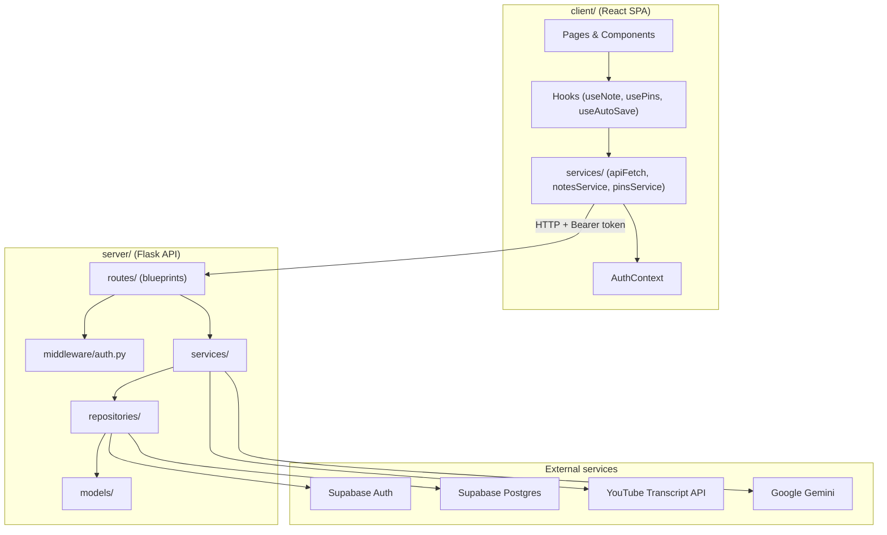
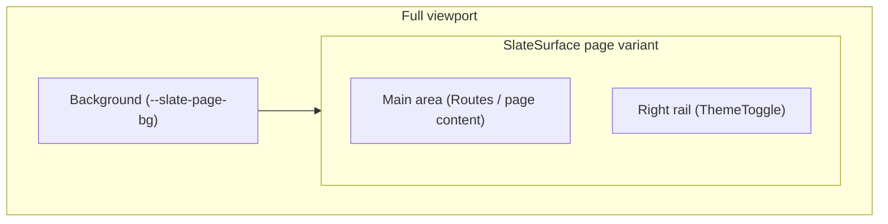
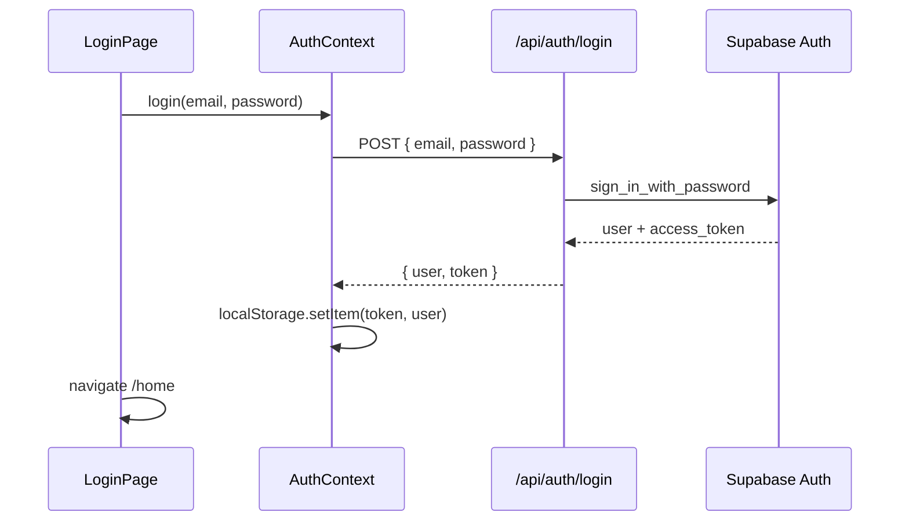
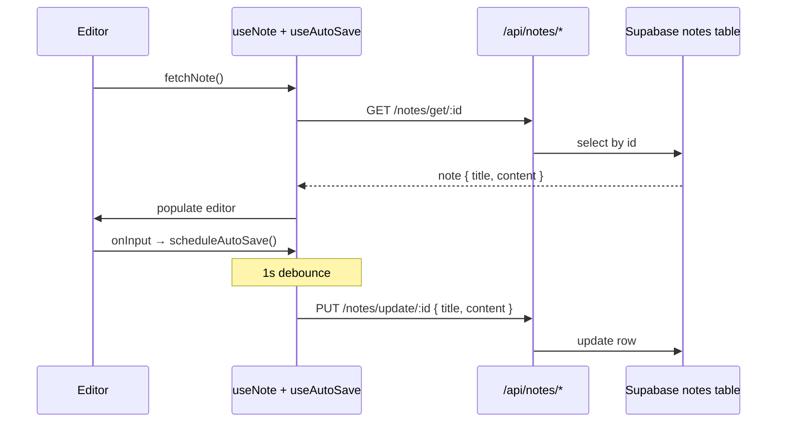
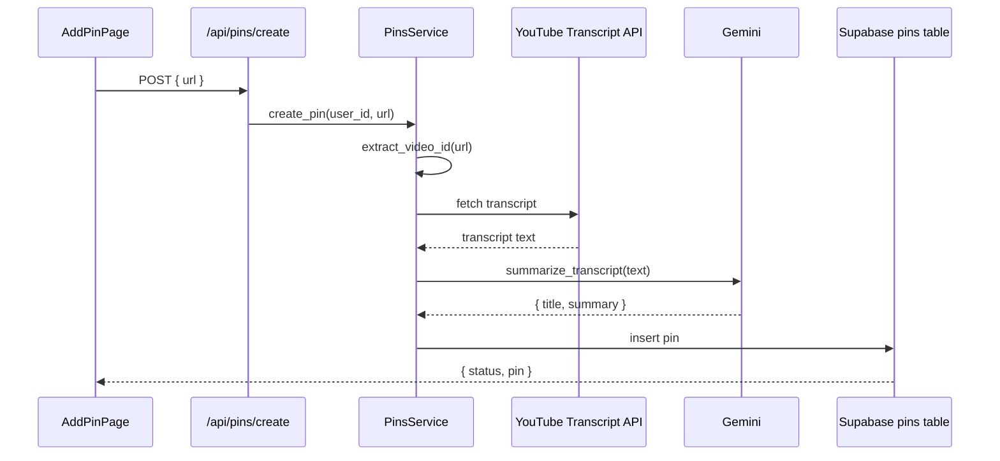

# Architecture

## Overview

pin-note is a client–server application. The React frontend talks to a Flask REST API, which owns all business logic and database access. External services (Supabase, Gemini, YouTube) are called only from the server layer.

## Backend layers

### Routes (`server/routes/`)

Thin HTTP handlers. Each blueprint parses the request, reads `g.user` (set by auth middleware), delegates to a service, and returns JSON.

| Blueprint | Prefix | Responsibility |
|-----------|--------|----------------|
| `auth_routes` | `/api/auth` | Register, login |
| `notes_routes` | `/api/notes` | CRUD for notes |
| `pins_routes` | `/api/pins` | List and create pins |

Services and repositories are instantiated once at module load time in each route file.

### Middleware (`server/middleware/auth.py`)

Runs on every request via `app.before_request`. Skips `OPTIONS` preflight and public auth routes (`/api/auth/login`, `/api/auth/register`). For all other paths under `/api/*`, validates the `Authorization: Bearer` token with Supabase and attaches the user to Flask's `g.user`.

### Services (`server/services/`)

Business logic and authorization rules. Services never execute SQL directly — they call repository interfaces.

| Service | Key behavior |
|---------|--------------|
| `AuthService` | Password length, email format, duplicate-email checks before delegating to Supabase Auth |
| `NotesService` | Ownership check on `get_note_by_id` (raises `ForbiddenError` if `user_id` mismatch) |
| `PinsService` | YouTube URL validation, transcript fetch, Gemini summarization, then persist via repository |

### Repositories (`server/repositories/`)

Abstract interfaces (`IUserRepository`, `INotesRepository`, `IPinsRepository`) with Supabase implementations. All database and auth-provider calls live here.

### Models (`server/models/`)

Plain Python classes (`User`, `Note`, `Pin`) with a `to_dict()` serializer. They carry no persistence logic.

### Utilities (`server/utils/`)

| Module | Purpose |
|--------|---------|
| `supabase_client.py` | Singleton Supabase client from env config |
| `gemini_client.py` | Prompt + call to `gemini-2.5-flash`; returns `{ title, summary }` JSON |
| `youtube_transcript.py` | Extract video ID from URL; fetch and join transcript snippets |

### Exceptions (`server/exceptions.py`)

`AppError` hierarchy with HTTP status codes. Global handlers in `app.py` convert raised errors to JSON responses.

## Frontend structure

### Routing (`client/src/App.tsx`)

| Path | Page | Auth |
|------|------|------|
| `/` | Login | Public |
| `/register` | Register | Public |
| `/home` | Home (notes + pins hub) | Protected |
| `/editor/:noteId` | Note editor | Protected |

`ProtectedRoute` redirects unauthenticated users to `/`.

All routes render inside `AppShell`, which provides the app-wide layout (themed background, fixed slate, theme toggle). Individual pages own only their inner content.

### App shell and layout

Every page shares a single UI shell: a themed full-viewport background with a centered **slate** (floating card) at **85vw × 85vh**. Route content renders inside the slate main area; a narrow right rail holds the theme toggle.

| Component | Path | Role |
|-----------|------|------|
| `AppShell` | `components/layout/AppShell.tsx` | Full-viewport background + page slate + theme rail; wraps all routes in `App.tsx` |
| `SlateSurface` | `components/layout/SlateSurface.tsx` | Shared surface primitive — `page` (app shell) or `modal` (overlays) |
| `ThemeToggle` | `components/layout/ThemeToggle.tsx` | Sun/Moon toggle in the right rail |
| `ThemeProvider` | `context/ThemeContext.tsx` | `"light"` / `"dark"` state, `localStorage` persistence, sets `data-theme` on `<html>` |

**Theme tokens** (`client/src/index.css`, under `[data-theme="light"]` / `[data-theme="dark"]`):

| Token | Light | Dark |
|-------|-------|------|
| `--slate-page-bg` | Soft pink background | Off-white background |
| `--slate-surface` | Cream slate | Black slate |
| `--slate-surface-text` | Dark text | Light text |
| `--slate-width` / `--slate-height` | 85vw / 85vh | 85vw / 85vh |

Theme is user-controlled via the toggle, separate from the OS `prefers-color-scheme` vars used elsewhere in `index.css`. An inline script in `index.html` reads `localStorage` before React hydrates to avoid a flash of the wrong theme.

**Modal overlays:** `FolderPanel` uses `SlateSurface` variant `modal` for in-slate overlays (folders, notes list, pins gallery, add pin). Home sub-views position these absolutely within the page's relative container.

**Editor constraints:** Floating pins use `react-rnd` with `bounds="parent"` so they stay inside the slate. The pin picker popup (`PinsPopup`) positions relative to the editor container, not the viewport.

### State and data fetching

- **Auth** — `AuthContext` holds `user`, `token`, and auth methods; persists to `localStorage`.
- **Theme** — `ThemeContext` holds `light` / `dark` preference; persists to `localStorage` and drives slate CSS variables.
- **Server data** — TanStack Query for notes and pins lists (`useQuery` in page components).
- **Editor state** — Custom hooks isolate concerns:
  - `useNote` — fetch/save a single note, owns the `contentEditable` ref
  - `useAutoSave` — debounced save (1 s)
  - `usePins` — pin picker popup and in-session floating pin positions

### API client

`apiFetch` attaches the Bearer token, handles 401 by clearing storage and redirecting to login, and throws on non-OK responses with the server's `message` field.

Auth endpoints (`login`, `register`) use raw `fetch` in `AuthContext` instead of `apiFetch` because they do not require a token.

## Data flow

### Authentication

### Note editing

Content is sanitized with DOMPurify before save (`getCleanHTML`). Allowed tags: `strong`, `em`, `code`, `br`, `p`, `div`.

### Pin creation

### Pin insertion in editor

This flow is entirely client-side after the initial pin list fetch:

1. User types `/` → `usePins.openPinsPopup` at cursor position
2. `getPins()` loads the user's saved pins
3. User selects a pin → added to `floatingPins` state with default x/y/width/height
4. `FloatingPin` renders via `react-rnd` (draggable, resizable)
5. Positions are **not** sent to the server — they exist only for the current editor session

## Database schema (inferred)

No migration files exist in the repo. Expected tables based on repository queries:

**profiles**
| Column | Used by |
|--------|---------|
| `id` | User ID (matches Supabase Auth user) |
| `email` | Duplicate check on signup |

**notes**
| Column | Used by |
|--------|---------|
| `id` | Primary key |
| `user_id` | Owner FK |
| `title` | Note title |
| `content` | HTML string |
| `updated_at` | Sort order (desc) |

**pins**
| Column | Used by |
|--------|---------|
| `id` | Primary key |
| `user_id` | Owner FK |
| `source_type` | e.g. `"youtube"` |
| `source_url` | Original URL |
| `title` | AI-generated title |
| `summary` | AI-generated summary |
| `created_at` | Sort order (desc) |

> **TODO:** Confirm RLS policies and whether `profiles` is populated by a Supabase trigger on signup.

## Design patterns

### Repository pattern (backend)

All database access goes through repository interfaces. Services depend on abstractions, not Supabase directly. See [rules.md](../rules.md).

### Global error handling (backend)

Routes raise `AppError` subclasses; `app.py` registers `@app.errorhandler` for `AppError` and a catch-all for unexpected exceptions. Routes avoid local try/catch for expected failures.

### Thin route, fat service

Route handlers validate required fields and call one service method. Authorization (note ownership) lives in the service layer.

### Hook-based composition (frontend)

The `Editor` page is intentionally thin — it wires hooks to presentational components. Async logic and refs live in hooks (`useNote`, `useAutoSave`, `usePins`).

### App shell pattern (frontend)

All routes render inside `AppShell` → `SlateSurface` (`page`). Pages supply only inner content; the shell owns background, slate dimensions, borders, shadow, and the theme rail. Overlays reuse `SlateSurface` (`modal`) via `FolderPanel`. See [App shell and layout](#app-shell-and-layout) above.

### Debounced auto-save with stale-closure guard

`useAutoSave` keeps the latest `saveFn` in a ref so the debounce timer always calls the current closure without resetting on every render.

## API response conventions

`rules.md` defines a target shape of `{ status, message, data }`. The current codebase uses several variants:

| Context | Shape |
|---------|-------|
| Success (notes/pins) | `{ status: "ok", notes/pins/note: ... }` |
| Success (auth) | `{ user, token }` (no `status` field) |
| AppError | `{ status: "error", message }` |
| Auth middleware failure | `{ message }` (no `status` field) |

See [docs/api.md](api.md) for per-endpoint details.

## CORS

The Flask app allows credentialed requests from `http://localhost:5173` on `/api/*` paths, matching the Vite dev server default.
